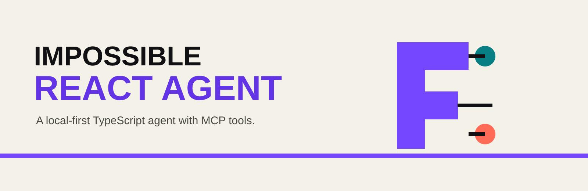

<picture>
  <source media="(prefers-color-scheme: dark)" srcset="docs/assets/banner-dark.svg">
  
</picture>

# Impossible ReAct Agent

A TypeScript template for an agent that reasons, calls local or MCP tools, observes their results, and continues until it can answer. It defaults to a local OpenAI-compatible model endpoint and also accepts any compatible hosted endpoint you configure.

ReAct means **Reasoning and Acting**. This repository is an agent runtime, not a React user interface.

## Included

- current LangChain `createAgent` runtime backed by LangGraph
- local OpenAI-compatible model configuration
- built-in example tools and optional MCP tool discovery
- conversation threads with in-memory checkpointing
- step limits, request deadlines, cancellation, and graceful shutdown
- CLI and HTTP entry points
- strict TypeScript, protocol-independent tests, integration tests, and coverage gates
- Docker, Compose, CI, security scanning, and release automation
- complete documentation and Impossible G repository artwork

## Start locally

Use any server that exposes an OpenAI-compatible chat-completions API. The defaults expect Ollama on `http://127.0.0.1:11434/v1` with `qwen3:8b`.

```bash
npm install
cp .env.example .env
npm run build
npm start -- --input "Count the words in: local models belong to you"
```

On PowerShell:

```powershell
Copy-Item .env.example .env
npm run build
npm start -- --input "What time is it?"
```

## HTTP API

```bash
npm start -- --serve
```

```bash
curl http://127.0.0.1:4141/v1/chat \
  -H "content-type: application/json" \
  -d '{"input":"Count the words in this sentence","threadId":"demo"}'
```

Health and readiness routes are available at `/healthz` and `/readyz`.

## Add MCP tools

Create a configuration file:

```json
{
  "mcpServers": {
    "local-tools": {
      "command": "node",
      "args": ["../impossible-mcp-template/dist/cli.js"]
    }
  }
}
```

Set `MCP_CONFIG_PATH` to its path. Tools from every configured server become available beside the built-in examples.

## Commands

| Command                        | Purpose                                             |
| ------------------------------ | --------------------------------------------------- |
| `npm run dev -- --input "..."` | Run one prompt with source files                    |
| `npm run dev -- --serve`       | Start the development HTTP API                      |
| `npm run build`                | Compile the production package                      |
| `npm test`                     | Run tests once                                      |
| `npm run test:coverage`        | Run tests and enforce coverage gates                |
| `npm run verify`               | Run formatting, linting, types, coverage, and build |

## Documentation

- [Architecture](docs/architecture.md)
- [Models](docs/models.md)
- [Tools and MCP](docs/tools-and-mcp.md)
- [HTTP API](docs/http-api.md)
- [Configuration](docs/configuration.md)
- [Operations](docs/operations.md)
- [Testing](docs/testing.md)

## License

[MIT](LICENSE)
